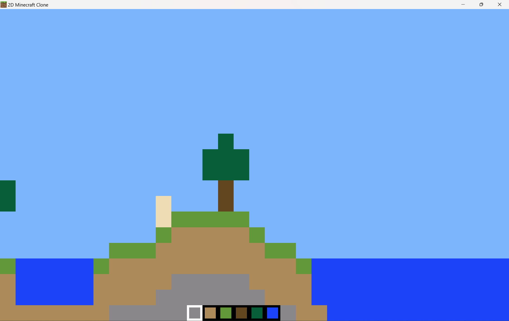

# 2D-Minecraft-Clone

Basic 2D block game using C++ and OpenGL, that incorperates perlin noise terrain generation, physics and block placement. Also build in python.

## Features

* Perlin Noise Terrain Generation
* Player physics
* Screen shifts to player
* Block remove/place

## Screenshots

## Compilation

The project uses a Makefile for compilation. To compile the project, use the following command:

**make**

## License

This project is licensed under the MIT License.
